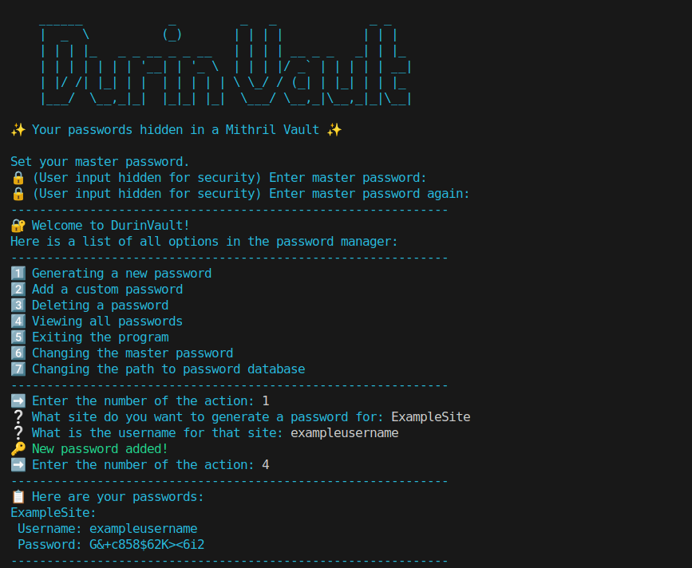

# DurinVault – Minimalist, Secure CLI Password Manager
    ______            _         _   _             _ _   
    |  _  \          (_)       | | | |           | | |  
    | | | |_   _ _ __ _ _ __   | | | | __ _ _   _| | |_ 
    | | | | | | | '__| | '_ \  | | | |/ _` | | | | | __|
    | |/ /| |_| | |  | | | | | \ \_/ / (_| | |_| | | |_ 
    |___/  \__,_|_|  |_|_| |_|  \___/ \__,_|\__,_|_|\__|


## Links
* [About](#about)  
* [Why DurinVault?](#why-durinvault)  
* [Features](#features)  
* [Installation](#installation)  
* [Example Use](#example-use-cli-screenshots)  
* [Cryptography / Security](#cryptography--security)  
* [Disclaimer](#disclaimer)  
* [License](#license)

## About
DurinVault is a **minimalist and secure CLI password manager** that runs entirely in your terminal.  
It is written in Python 3 making it a cross platform tool.
All your passwords are stored locally in an **AES-GCM encrypted file**
Access is protected by a master password hashed with **Argon2id**.


## Why DurinVault
DurinVault is a **minimalist, fast, and powerful CLI password manager**.  
All your passwords are safely hidden behind the ancient *Doors of Durin* (project name and design inspired by *The Lord of the Rings*).

This tool was specifically designed to be free from unnecessary features.  
It runs entirely on your device, without requiring any accounts or third-party services.  

DurinVault is perfect for people who want a **lightweight, reliable, and privacy-focused password manager**, combining simplicity with strong security.
This password manager is like a cast-iron pan, brutally simple yet unbreakable and timeless.

## Features
* **Generate strong passwords** – automatically creates secure passwords.
* **Add custom passwords** – manually add your own passwords.
* **Delete passwords** – remove passwords you no longer need.
* **View stored passwords** – see all saved passwords.
* **Change master password** – update your master password securely.
* **Change database file location** – move your encrypted password database file 

### Generate Strong Passwords
DurinVault automatically generates **strong passwords** with 14–18 characters, including letters, digits, and special characters.  
The final password is shuffled for maximum security.

### Add Custom Passwords
Easily add your own passwords if you prefer memorable or pre-existing credentials.

### Delete Passwords
Remove entries safely and efficiently. All deletions are immediately reflected in your encrypted database.

### View Stored Passwords
View all saved credentials in a readable table directly in the terminal.  
The data remains encrypted on disk for maximum security.

### Change Master Password
Update your master password at any time.  
All data stays encrypted using the new master password.

### Change Database File Location
Move your encrypted database to a new path.
This function will open a window where you can select the desired folder. 
This is the only place where the program uses the GUI but this is only to make it more convinient instead of typing the path manually where it is easy to make a mistake.
This is especially useful for syncing your passwords across multiple devices using tools like Syncthing.


## Installation
If you want to copy the code and run it as a script:

```bash
# Clone the repository
git clone https://github.com/mkaleta11/DurinVault.git
cd DurinVault

# (Optional) Create and activate a virtual environment
python3 -m venv venv
source venv/bin/activate      # Linux/macOS
venv\Scripts\activate         # Windows

# Install dependencies
pip install -r requirements.txt

# Run DurinVault
python3 main.py               # Linux/macOS
python main.py                # Windows
```

## Example Use



## Cryptography/Security
The first time you run the program you set the master password. The master password will derive a unique key with Argon2id a most secure hashing algorithm up-to-date.
Read more about . 
The file will be encrypted with AES-GCM encryption algorithm that needs the key as a parameter to make it unique and not work without the master password.
Learn about 
All of this makes the database encrypted **without storing the master password anywhere**.
Then on next runs you will use the master password to decrypt the database.

## Disclaimer
**IMPORTANT PLEASE READ**
DurinVault is a personal project created primarily for learning and personal use.
I do not take any responsibility for improper use of this software.

That said, the tool was designed to be as secure and professional as possible and to actually be used.
You can use it safely, but please be aware of the following important points:

* The first time you run the program, the master password you provide will become your permanent master password.

* The database is encrypted using this exact password. **If you forget it, you will lose access to all stored passwords**.

* You can change the master password only after logging into the database.

## License
This project is licensed under the [MIT License](LICENSE).